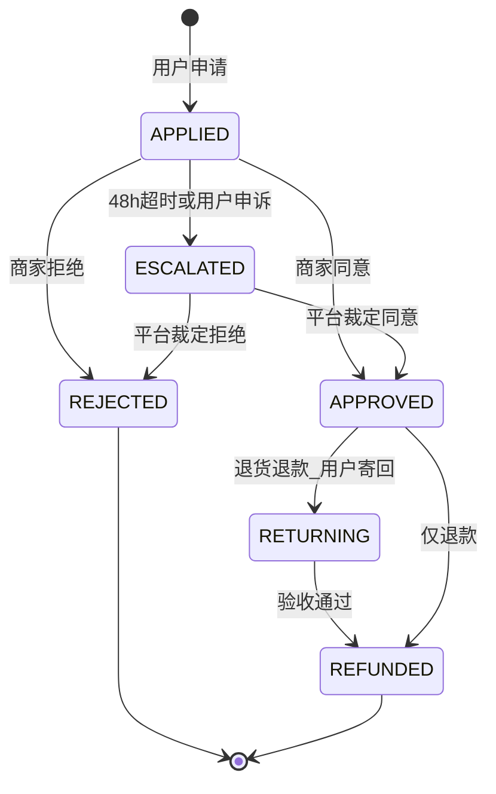
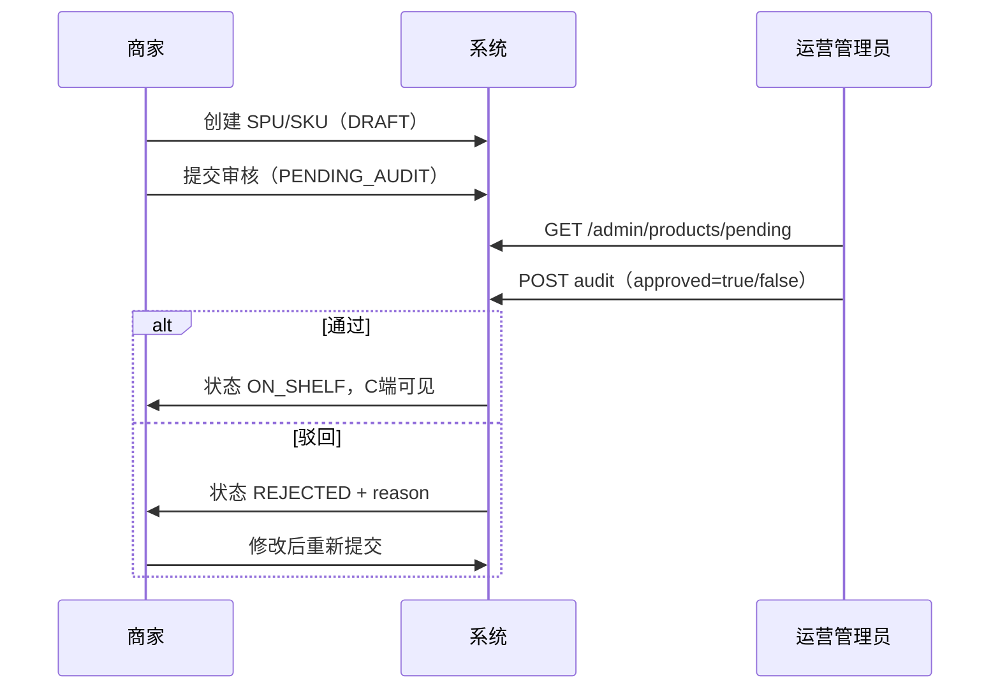

# 平台管理后台（Admin）

> 组长主责文档。开发 `packages/web-admin` 与 Admin/Order 相关 API 时，与 `DOMAIN_MODEL.md`、`openapi.yaml` 一起 @ 引用。

## 1. 功能清单

| 功能 | 优先级 | 用户故事 | 依赖 | 状态 |
|------|--------|----------|------|------|
| 管理员登录 | P0 | JWT 登录，区分 OPERATOR / CS_AGENT 角色 | 无 | ✅ |
| 商品审核队列 | P0 | 查看待审 SPU、通过/驳回（须填原因） | B：商家提交 `PENDING_AUDIT` | ✅ |
| 工作台待办数 | P1 | 展示待审商品数、待仲裁售后数 | 审核/售后 API 就绪 | ✅ |
| 全平台订单查询 | P1 | 按订单号/用户/商家/状态筛选 | 订单数据已有 | ✅ |
| 售后仲裁 | P1 | 处理 `ESCALATED` 工单，裁定同意/拒绝 | A 申请 + B 超时未审 | ✅ |
| 商家入驻审核 | P1 | 审核入驻申请（可简化表单） | B 提交入驻 | ✅ MySQL 持久化 |
| 类目管理 | P2 | 维护类目树（时间不够可只读） | B 提供类目 API | ⬜ |

---

## 2. 管理员角色与权限

| 角色 | 英文 Key | 说明 |
|------|----------|------|
| 运营管理员 | `OPERATOR` | 商品审核、商家审核、类目维护 |
| 客服管理员 | `CS_AGENT` | 全平台订单查询、售后仲裁、异常单处理 |

### 权限矩阵

| 操作 | 用户 | 商家 | OPERATOR | CS_AGENT |
|------|------|------|----------|----------|
| 申请退款/售后 | ✓ | — | — | — |
| 审核售后（48h 内） | — | ✓ | — | — |
| 售后仲裁（超时/申诉） | — | — | — | ✓ |
| 商品上架审核 | — | 提交 | ✓ | — |
| 商家入驻审核 | — | 提交 | ✓ | — |
| 全平台订单查询 | 自己的 | 本店 | ✓ | ✓ |
| 强制关闭异常单 | — | — | — | ✓ |

**鉴权规则：** Admin 接口必须使用 `Authorization: Bearer <token>`，后端校验 `role` 字段；用户/商家 token 调用 Admin 接口返回 403。

---

## 3. 售后三方联动

对应领域规则：商家 48h 未处理售后 → 自动或用户手动升级为 `ESCALATED`，由 `CS_AGENT` 仲裁。



| 规则 | 说明 |
|------|------|
| 超时阈值 | 商家需在 48h 内处理；超时系统自动标记 `ESCALATED` |
| 用户申诉 | `APPLIED` 状态下用户可点击「申请平台介入」→ `ESCALATED` |
| 仲裁主体 | 仅 `CS_AGENT` 可调用 `/admin/after-sales/{id}/arbitrate` |
| 退货寄回 | `RETURN_REFUND` 同意后为 `APPROVED`；用户 `POST .../return` → `RETURNING`；商家 `confirm-return` → `REFUNDED` |
| 仅退款 | `REFUND_ONLY` 同意后直接 `REFUNDED`（不经 RETURNING） |
| 订单联动 | 售后 `REFUNDED` 后，关联订单 → `REFUNDED`；库存 `available += quantity` |
| 商家拒绝后 | 用户可申诉升级；或直接接受拒绝关闭 |

---

## 4. 商品审核流程



**审核检查项：** 标题合规、类目正确、价格合理、主图可访问、SKU 规格完整。

---

## 5. 页面路由（web-admin）

| 路由 | 页面 | 优先级 | 说明 |
|------|------|--------|------|
| `/login` | 登录 | P0 | 账号+密码，存 JWT |
| `/audit/products` | 商品审核 | P0 | Tab：待审核/已审核/全部记录；表格+详情抽屉 |
| `/dashboard` | 工作台 | P1 | 统计卡片、快捷入口、待办预览（按角色） |
| `/orders` | 订单查询 | P1 | 筛选+详情，只读 |
| `/after-sales` | 售后仲裁 | P1 | Tab：待仲裁 / 已完成；待仲裁可裁定 |
| `/audit/merchants` | 商家审核 | P1 | 入驻申请列表 |
| `/categories` | 类目管理 | P2 | 树形编辑或只读 |

布局遵循 [`docs/ui/UI_GUIDE.md`](../ui/UI_GUIDE.md) §5.2：深色侧边栏 + 顶栏 + 表格列表，操作列固定右侧。

---

## 6. API 清单

详见 [`docs/api/openapi.yaml`](../api/openapi.yaml) `admin` tag。

| Method | Path | 角色 | 说明 |
|--------|------|------|------|
| POST | `/auth/admin/login` | — | 管理员登录 |
| GET | `/admin/dashboard/summary` | OPERATOR, CS_AGENT | 工作台统计 + 待办预览列表 |
| GET | `/admin/products/pending` | OPERATOR | 待审核商品列表 |
| GET | `/admin/products/audits` | OPERATOR | 商品审核历史记录 |
| POST | `/admin/products/{spuId}/audit` | OPERATOR | 审核通过/驳回 |
| GET | `/admin/orders` | OPERATOR, CS_AGENT | 全平台订单（筛选） |
| GET | `/admin/orders/{orderId}` | OPERATOR, CS_AGENT | 订单详情 |
| GET | `/admin/after-sales` | CS_AGENT | 售后列表（status：ESCALATED / COMPLETED 等） |
| POST | `/admin/after-sales/{id}/arbitrate` | CS_AGENT | 平台裁定 |
| GET | `/admin/merchants/pending` | OPERATOR | 待审核商家（P1） |
| POST | `/admin/merchants/{id}/audit` | OPERATOR | 商家审核（P1） |

---

## 7. 与 A/B 的交接顺序

| 阶段 | 顺序 | 负责人 | 交付 |
|------|------|--------|------|
| W1 末 | 0 | 组长 | openapi v0.2、JWT 约定、DDL、后端脚手架 |
| W2 初 | 1 | B → 组长 → B → A | 商家提交审核 → Admin 审核 → C端商品 API → 用户浏览 |
| W2 中 | 2 | A → 组长 → A → B | 购物车 → 下单/支付 API → 结算页 → 商家发货 |
| W2 末 | 3 | 全员 | 端到端联调：浏览→审核→下单→支付→发货 |
| W3 | 4 | A → B → 组长 | 用户申请售后 → 商家审核 → 平台仲裁 |

**共享文件：** 改 `openapi.yaml` 前群里通知；`admin`/`order` tag 组长主责，`product`/`merchant` 归 B，`user`/`cart` 归 A。

---

## 8. Cursor 开发引用

写 Admin 代码时固定 @ 引用：

```
@docs/domain/ADMIN.md
@docs/domain/DOMAIN_MODEL.md
@docs/api/openapi.yaml
@docs/ui/UI_GUIDE.md
```

改接口字段时：**先改 openapi.yaml，再写代码**。
