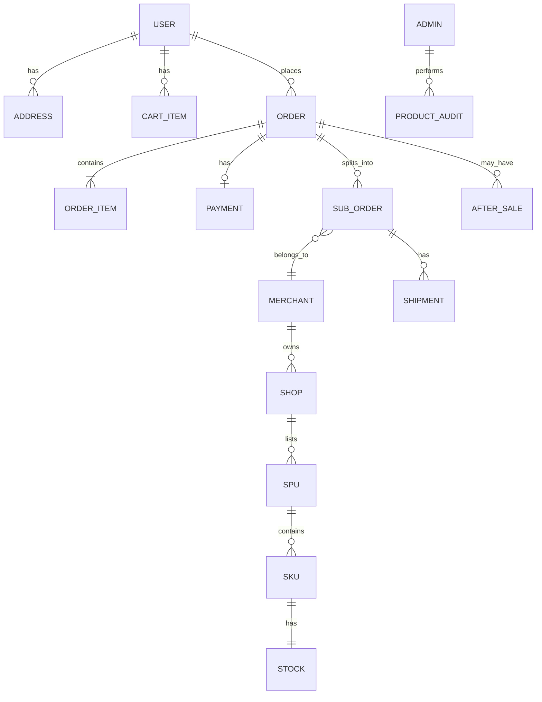
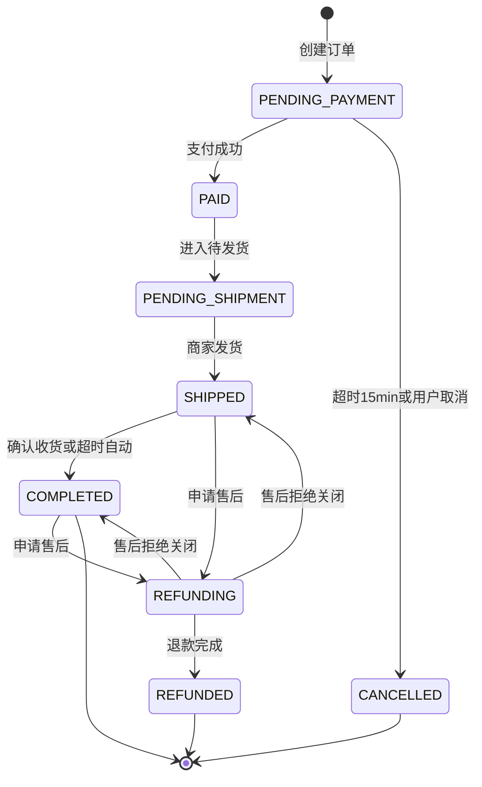
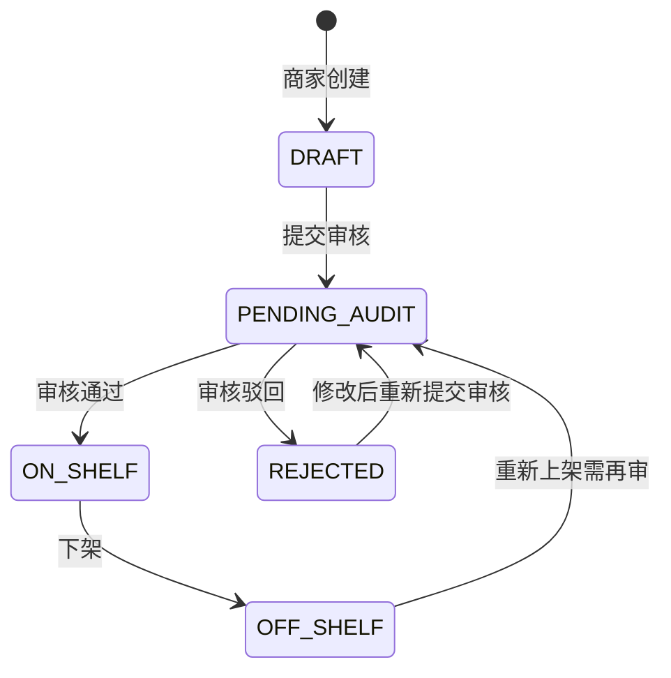
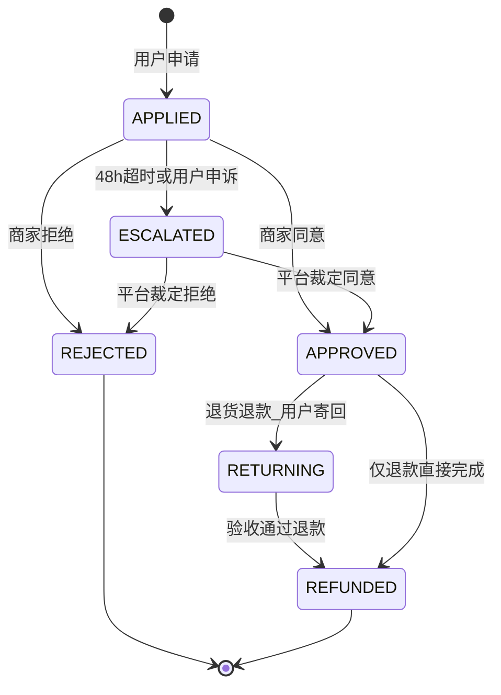

# 领域模型（Domain Model）

> 描述核心业务实体、关系与状态机。开发前与 `docs/BUSINESS_GLOSSARY.md` 一起阅读。  
> 管理后台详见 [`docs/domain/ADMIN.md`](ADMIN.md)。

## 1. 限界上下文（Bounded Contexts）

```
┌──────────────┐  ┌──────────────┐  ┌──────────────┐
│   用户上下文   │  │   商品上下文   │  │   交易上下文   │
│ User/Cart    │  │ SPU/SKU/Stock│  │ Order/Payment│
└──────┬───────┘  └──────┬───────┘  └──────┬───────┘
       │                 │                 │
       └─────────────────┼─────────────────┘
                         │
       ┌─────────────────┼─────────────────┐
       │                 │                 │
┌──────▼───────┐  ┌──────▼───────┐  ┌──────▼───────┐
│  商家上下文    │  │  平台上下文    │  │ 物流/售后上下文 │
│ Merchant/Shop│  │ Admin/Audit  │  │ Shipment/AS  │
└──────────────┘  └──────────────┘  └──────────────┘
```

| 上下文 | 核心聚合根 | 负责成员 | 说明 |
|--------|------------|----------|------|
| 用户 | User, Cart, Address | 成员 A | 注册登录、购物车、收货地址 |
| 商品 | SPU, SKU, Stock, Category | 成员 B | 商品发布、库存、类目 |
| 交易 | Order, SubOrder, Payment | 组长 | 下单、拆单、mock 支付 |
| 商家 | Merchant, Shop | 成员 B | 入驻、店铺、发货 |
| 平台 | Admin, ProductAudit | 组长 | 商品/商家审核、仲裁 |
| 物流售后 | Shipment, AfterSale | A 申请 / B 审核 / 组长仲裁 | 发货、退款退货 |

---

## 2. 核心实体关系（ER 概览）



### 实体说明

#### User（用户）
- **属性**：`id`, `phone`, `passwordHash`, `nickname`, `avatarUrl`, `createdAt`
- **不变式**：手机号唯一；`avatarUrl` 可选，为头像图片 URL（含演示用 data URL）

#### Address（收货地址）
- **属性**：`id`, `userId`, `receiverName`, `phone`, `province`, `city`, `district`, `detail`, `isDefault`

#### Favorite（商品收藏）
- **属性**：`id`, `userId`, `spuId`, `createdAt`
- **不变式**：同一用户对同一 SPU 仅可收藏一次；仅本人可读写

#### SPU / SKU / Stock
- **SPU**：`id`, `shopId`, `categoryId`, `title`, `description`, `mainImage`, `status`（见商品审核状态机）
- **SKU**：`id`, `spuId`, `specJson`, `price`
- **Stock**：`skuId`, `available`, `locked`（`sold` 可选统计字段）
- **不变式**：`available >= 0`，`locked >= 0`；扣减/释放时原子更新

#### Order（主订单）
- **属性**：`id`, `orderNo`, `userId`, `addressSnapshot`（JSON）, `totalAmount`, `status`, `createdAt`
- **不变式**：`totalAmount = sum(order_items.price * quantity)`；下单时写入商品快照

#### OrderItem（订单项）
- **属性**：`id`, `orderId`, `subOrderId`, `skuId`, `title`, `specJson`, `price`, `quantity`
- **不变式**：`title`/`price` 为下单快照，不随 SKU 改价变化

#### SubOrder（子订单，按商家拆单）
- **属性**：`id`, `orderId`, `merchantId`, `shopId`, `status`, `shipmentId`
- **不变式**：同一主订单按 `merchantId` 拆分；商家只见自己的 sub_order

#### Payment（支付）
- **属性**：`id`, `orderId`, `amount`, `status`（`PENDING`/`SUCCESS`/`FAILED`）, `paidAt`
- **规则**：Mock 支付，点击即 `SUCCESS`，触发订单 `PENDING_PAYMENT → PAID → PENDING_SHIPMENT`

#### Shipment（物流）
- **属性**：`id`, `subOrderId`, `logisticsCompany`, `trackingNo`, `shippedAt`

#### AfterSale（售后）
- **属性**：`id`, `orderId`, `subOrderId`, `userId`, `merchantId`, `type`（`REFUND_ONLY`/`RETURN_REFUND`）, `reason`, `status`, `appliedAt`, `merchantDeadline`, `items`（售后商品行：`skuId`/`title`/`price`/`quantity`）
- **不变式**：
  - 仅 `SHIPPED`/`COMPLETED` 订单可申请
  - **按 SKU 申请**：一次售后可包含同一子单下若干 SKU；本迭代为「整件」——每个 SKU 的申请数量须等于该 SKU 剩余可售后数量（下单量 − 非 `REJECTED` 售后占用）
  - **一单多笔**：同一订单允许并存多笔售后，只要 SKU 剩余可售后数量足够；禁止对已被占用的数量重复申请
  - 子单/主单进入 `REFUNDING`：存在进行中售后（`APPLIED`/`ESCALATED`/`APPROVED`/`RETURNING`）时
  - 主单 `REFUNDED`：仅当该订单全部商品数量均已进入售后终态 `REFUNDED` 时
  - 售后拒绝：若订单上无其它进行中售后，主单/子单退出 `REFUNDING` 恢复 `SHIPPED`（或保持已完成语境下的可售后状态，实现上恢复 `SHIPPED`）

#### Admin（平台管理员）
- **属性**：`id`, `username`, `passwordHash`, `role`（`SUPER_ADMIN`/`OPERATOR`/`CS_AGENT`）, `status`（`ACTIVE`/`DISABLED`）, `createdAt`
- **不变式**：
  - `DISABLED` 不可登录；业务接口鉴权时亦拒绝
  - 至少保留 1 个 `ACTIVE` 的 `SUPER_ADMIN`
  - 不可禁用自己；不可通过 API 创建或提升为 `SUPER_ADMIN`（仅 seed 预置）
  - `SUPER_ADMIN` 继承 `OPERATOR` 与 `CS_AGENT` 全部业务权限，并可管理运营/客服账号

#### ProductAudit（商品审核记录）
- **属性**：`id`, `spuId`, `adminId`, `approved`, `reason`, `auditedAt`

#### ChatThread / ChatMessage（售后沟通）
- 详见 [`CHAT.md`](CHAT.md)
- **已实现**：`USER_CS`（用户 ↔ 平台客服）、`USER_MERCHANT`（用户 ↔ 商家）
- **不变式**：同一 `afterSaleId` + `type` 至多一条 `OPEN` 会话；聊天快捷动作须走已有售后 API，不得绕过状态机

---

## 3. 订单状态机



| 状态 | 英文 | 触发条件 | 允许操作 |
|------|------|----------|----------|
| 待支付 | PENDING_PAYMENT | 下单成功 | 支付、取消 |
| 已支付 | PAID | mock 支付成功 | —（瞬时态，进入待发货） |
| 待发货 | PENDING_SHIPMENT | 支付完成 | 商家发货 |
| 已发货 | SHIPPED | 填写物流 | 确认收货、申请售后 |
| 已完成 | COMPLETED | 确认收货 | 申请售后（可选） |
| 已取消 | CANCELLED | 未支付取消 | — |
| 退款中 | REFUNDING | 售后受理 | — |
| 已退款 | REFUNDED | 退款成功 | — |

### 业务决策（已接受）

**Q1：库存何时扣减？**
- [x] 下单锁库存（`available → locked`），15min 未支付超时释放
- [x] 支付成功后扣减（`locked → 0`，等价于售出）
- 取消/超时：`locked → available`

**Q2：是否拆单？**
- [x] 按商家拆 `SubOrder`（同一购物车多商家 → 一个主订单 + 多个子订单）
- 说明：商家后台只见本店 sub_order；用户见主订单聚合展示

**Q3：促销？**
- 不做优惠券/满减/秒杀；单价 = SKU.price

**支付方案：**
- Mock：前端调 `POST /orders/{id}/pay` 即成功，写 `payments` 表

**售后超时：**
- 商家 48h 未处理 → `AfterSale.status = ESCALATED`；用户亦可主动「申请平台介入」
- `CS_AGENT` 仲裁，详见 [`ADMIN.md`](ADMIN.md) §3

---

## 4. 商品审核状态机



| 状态 | 英文 | C 端可见 |
|------|------|----------|
| 草稿 | DRAFT | 否 |
| 待审核 | PENDING_AUDIT | 否 |
| 已上架 | ON_SHELF | 是 |
| 已驳回 | REJECTED | 否 |
| 已下架 | OFF_SHELF | 否 |

---

## 5. 售后状态机



| 状态 | 英文 | 说明 |
|------|------|------|
| 已申请 | APPLIED | 等待商家处理，48h 倒计时 |
| 已同意 | APPROVED | 进入退款或退货流程 |
| 已拒绝 | REJECTED | 商家或平台拒绝 |
| 已升级 | ESCALATED | 待平台客服仲裁 |
| 退货中 | RETURNING | 用户已寄回，待商家验收 |
| 已退款 | REFUNDED | 退款完成，订单 → REFUNDED，库存回滚 |

**Demo 约定：**
- `REFUND_ONLY`：商家/平台同意后直接 `REFUNDED`
- `RETURN_REFUND`：同意后停在 `APPROVED`，用户填写寄回物流 → `RETURNING`，商家验收 → `REFUNDED`

---

## 6. 领域事件

| 事件 | 触发时机 | 下游影响 |
|------|----------|----------|
| OrderCreated | 订单创建 | 锁库存 |
| OrderPaid | 支付成功 | 子订单待发货，通知商家 |
| OrderShipped | 已发货 | 用户可见物流 |
| OrderCompleted | 确认收货 | 交易完成 |
| OrderCancelled | 未支付取消 | 释放锁定库存 |
| ProductApproved | 商品审核通过 | C 端列表可见 |
| AfterSaleEscalated | 售后升级 | CS_AGENT 待办 |
| AfterSaleRefunded | 退款完成 | 订单 REFUNDED，库存回滚 |

---

## 7. 数据库表清单

| 表名 | 说明 | 负责人 |
|------|------|--------|
| users | 用户 | 成员 A |
| addresses | 收货地址 | 成员 A |
| cart_items | 购物车 | 成员 A |
| favorites | 商品收藏 | 成员 A |
| merchants | 商家 | 成员 B |
| shops | 店铺 | 成员 B |
| categories | 类目 | 成员 B |
| spus | 标准产品 | 成员 B |
| skus | SKU | 成员 B |
| stocks | 库存 | 成员 B |
| orders | 主订单 | 组长 |
| order_items | 订单项（含快照） | 组长 |
| sub_orders | 子订单 | 组长 |
| payments | 支付记录 | 组长 |
| shipments | 物流 | 成员 B |
| after_sales | 售后 | 组长（API）/ A+B 协作 |
| chat_threads | 售后会话（USER_CS 已实现；USER_MERCHANT 预留） | 组长 |
| chat_messages | 会话消息 | 组长 |
| admins | 平台管理员 | 组长 |
| product_audits | 商品审核记录 | 组长 |
| merchant_audits | 商家审核记录 | 组长 |

**Migration 合并顺序：** users → merchants/shops/categories/spus/skus/stocks → orders → after_sales → chat_*
