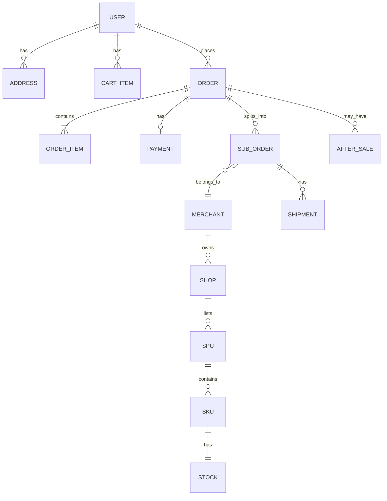
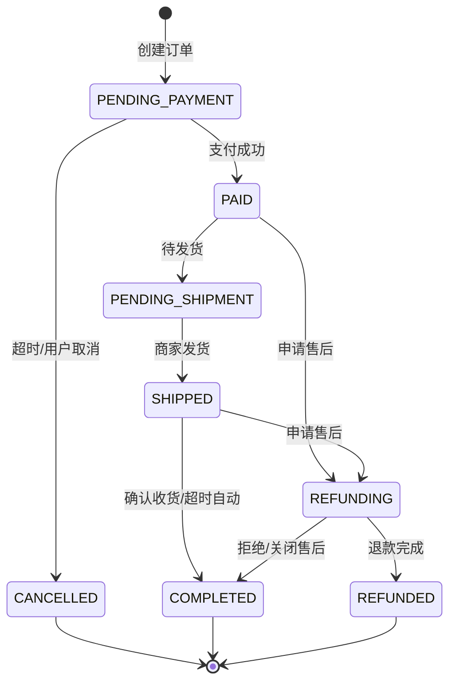
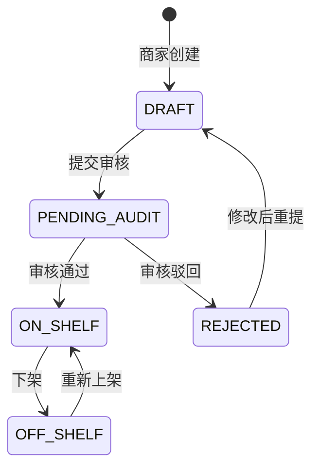
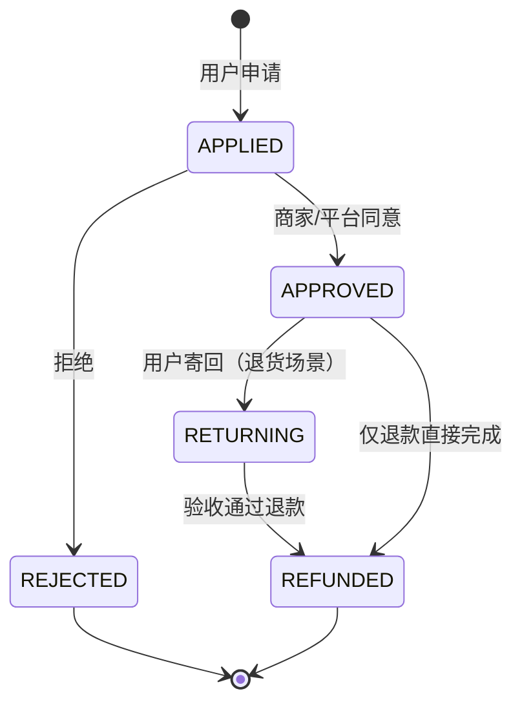

# 领域模型（Domain Model）

> 描述核心业务实体、关系与状态机。开发前与 `docs/BUSINESS_GLOSSARY.md` 一起阅读。

## 1. 限界上下文（Bounded Contexts）

```
┌──────────────┐  ┌──────────────┐  ┌──────────────┐
│   用户上下文   │  │   商品上下文   │  │   交易上下文   │
│ User/Cart    │  │ SPU/SKU/Stock│  │ Order/Payment│
└──────┬───────┘  └──────┬───────┘  └──────┬───────┘
       │                 │                 │
       └─────────────────┼─────────────────┘
                         │
       ┌─────────────────┼─────────────────┐
       │                 │                 │
┌──────▼───────┐  ┌──────▼───────┐  ┌──────▼───────┐
│  商家上下文    │  │  平台上下文    │  │ 物流/售后上下文 │
│ Merchant/Shop│  │ Admin/Audit  │  │ Shipment/AS  │
└──────────────┘  └──────────────┘  └──────────────┘
```

### 各上下文职责（填写）

| 上下文 | 核心聚合根 | 负责成员 | 说明 |
|--------|------------|----------|------|
| 用户 | User, Cart | 成员 A | |
| 商品 | SPU, SKU, Stock | 成员 B | |
| 交易 | Order, Payment | 组长 | |
| 商家 | Merchant, Shop | 成员 B | |
| 平台 | Admin, Audit | 组长 | |
| 物流售后 | Shipment, AfterSale | <!-- 待定 --> | |

---

## 2. 核心实体关系（ER 概览）



### 实体说明（调研后补充）

#### User（用户）
- **属性**：<!-- id, username, phone, memberLevel, createdAt -->
- **不变式**：<!-- 如：手机号唯一 -->

#### SPU / SKU / Stock
- **SPU**：<!-- 标题、类目、品牌、主图 -->
- **SKU**：<!-- 规格属性 JSON、价格、所属 SPU -->
- **Stock**：<!-- available, locked, sold -->
- **不变式**：<!-- 如：库存不能为负 -->

#### Order（订单）
- **属性**：<!-- orderNo, userId, totalAmount, status, createdAt -->
- **不变式**：<!-- 如：金额 = 各 OrderItem 之和 -->

<!-- 继续补充 Merchant, Payment, AfterSale 等 -->

---

## 3. 订单状态机



### 状态枚举（代码对齐用）

| 状态 | 英文 | 触发条件 | 允许操作 |
|------|------|----------|----------|
| 待支付 | PENDING_PAYMENT | 下单成功 | 支付、取消 |
| 已支付 | PAID | 支付回调 | — |
| 待发货 | PENDING_SHIPMENT | 支付完成 | 商家发货 |
| 已发货 | SHIPPED | 填写物流 | 确认收货、申请售后 |
| 已完成 | COMPLETED | 确认收货 | 评价（可选） |
| 已取消 | CANCELLED | 未支付取消 | — |
| 退款中 | REFUNDING | 售后受理 | — |
| 已退款 | REFUNDED | 退款成功 | — |

### 业务决策记录（必填，体现理解深度）

**Q1：库存何时扣减？**
- [ ] 下单锁库存，超时释放
- [ ] 支付成功后扣减
- [ ] 其他：<!-- 说明 -->

**Q2：是否拆单？按什么维度？**
- [ ] 按商家拆单
- [ ] 按仓库拆单
- [ ] 不拆单（简化）
- 说明：<!-- -->

**Q3：促销叠加顺序？**
- 说明：<!-- 如：会员价 → 满减 → 优惠券 -->

---

## 4. 商品审核状态机



---

## 5. 售后状态机



---

## 6. 领域事件（可选，加分项）

| 事件 | 触发时机 | 下游影响 |
|------|----------|----------|
| OrderCreated | 订单创建 | 锁库存 |
| OrderPaid | 支付成功 | 通知商家发货 |
| OrderShipped | 已发货 | 通知用户、更新物流 |
| OrderCompleted | 交易完成 | 结算、释放锁定资源 |
| ProductApproved | 商品审核通过 | C 端可见 |

---

## 7. 数据库表清单（草案）

| 表名 | 说明 | 负责人 |
|------|------|--------|
| users | 用户 | 成员 A |
| addresses | 收货地址 | 成员 A |
| cart_items | 购物车 | 成员 A |
| merchants | 商家 | 成员 B |
| shops | 店铺 | 成员 B |
| spus | 标准产品 | 成员 B |
| skus | SKU | 成员 B |
| stocks | 库存 | 成员 B |
| orders | 主订单 | 组长 |
| order_items | 订单项 | 组长 |
| sub_orders | 子订单 | 组长 |
| payments | 支付记录 | 组长 |
| shipments | 物流 | <!-- --> |
| after_sales | 售后 | <!-- --> |
| admins | 平台管理员 | 组长 |
| product_audits | 商品审核 | 组长 |

<!-- 开发时补充字段级 ER 图或 DDL -->
