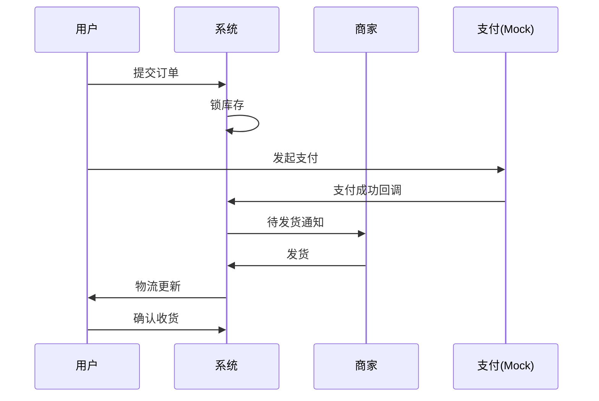

# 平台域 + 交易域调研 — 组长

> 完成后合并要点到 `docs/BUSINESS_GLOSSARY.md` 与 `docs/domain/DOMAIN_MODEL.md`

## 1. 调研目标

- 订单全生命周期与状态机
- 支付、促销、拆单、库存一致性
- 平台审核、权限、运营能力边界

## 2. 调研问题清单

- [ ] 订单何时创建？幂等如何保证？
- [ ] 库存扣减：下单锁 vs 支付扣？超时释放策略？
- [ ] 多商家购物车如何拆单？
- [ ] 优惠券/满减是否实现？叠加规则？
- [ ] 平台管理员角色划分？审核权限？
- [ ] 售后对订单状态和库存如何回滚？

## 3. 订单状态调研对比

| 状态 | 京东（参考） | 本项目 |
|------|--------------|--------|
| 待支付 | | PENDING_PAYMENT |
| 待发货 | | |
| 已发货 | | |
| 已完成 | | |
| 退款中 | | |

## 4. 交易泳道图（填写）

## 5. 平台审核流程

- 商品审核字段：<!-- 标题、类目、价格、图片合规 -->
- 审核 SLA：<!-- 简化：同步审核即可 -->

## 6. ADR 待决事项

填写 `docs/DECISIONS.md`：
- [ ] ADR-001 库存扣减
- [ ] ADR-002 拆单
- [ ] ADR-004 支付 Mock

## 7. 结论

### P0 API 列表（供 openapi.yaml）
| Method | Path | 说明 |
|--------|------|------|
| POST | /api/orders | 创建订单 |
| POST | /api/orders/{id}/pay | Mock 支付 |
| GET | /api/admin/products/pending | 待审核商品 |
| POST | /api/admin/products/{id}/audit | 审核 |

## 8. 参考资料

- 
