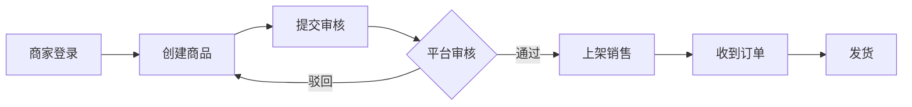

# 商品域 + 商家域调研 — 成员 B

> 完成后合并要点到 `docs/BUSINESS_GLOSSARY.md` 与 `docs/domain/DOMAIN_MODEL.md`

## 1. 调研目标

- 理解 SPU/SKU/库存/类目/品牌模型
- 理解商家入驻、上架、履约、结算流程
- 对比京东 POP 商家后台能力

## 2. 调研问题清单

- [ ] SPU 与 SKU 如何划分？规格属性如何存储？
- [ ] 库存粒度？是否支持多仓库（建议 3 周不做）？
- [ ] 谁创建类目？商家能否自建类目？
- [ ] 商品上架是否必须审核？审核什么？
- [ ] 商家如何处理退款/售后？
- [ ] 结算周期 T+N 是否实现？还是仅文档？

## 3. 商品模型草图（填写）

```
Category (树)
    └── SPU (title, brand, categoryId, mainImage)
            └── SKU (specJson, price, barcode?)
                    └── Stock (available, locked)
```

## 4. 商家履约流程



## 5. 竞品笔记

<!-- -->

## 6. 结论与建议

### 6.1 P0 功能
-

### 6.2 数据模型建议
-

### 6.3 与交易域接口（与组长对齐）
| 接口 | 说明 |
|------|------|
| 锁库存 | 下单时 |
| 扣库存 | 支付后 |
| 商品快照 | 订单项存 price/title |

## 7. 参考资料

- 
