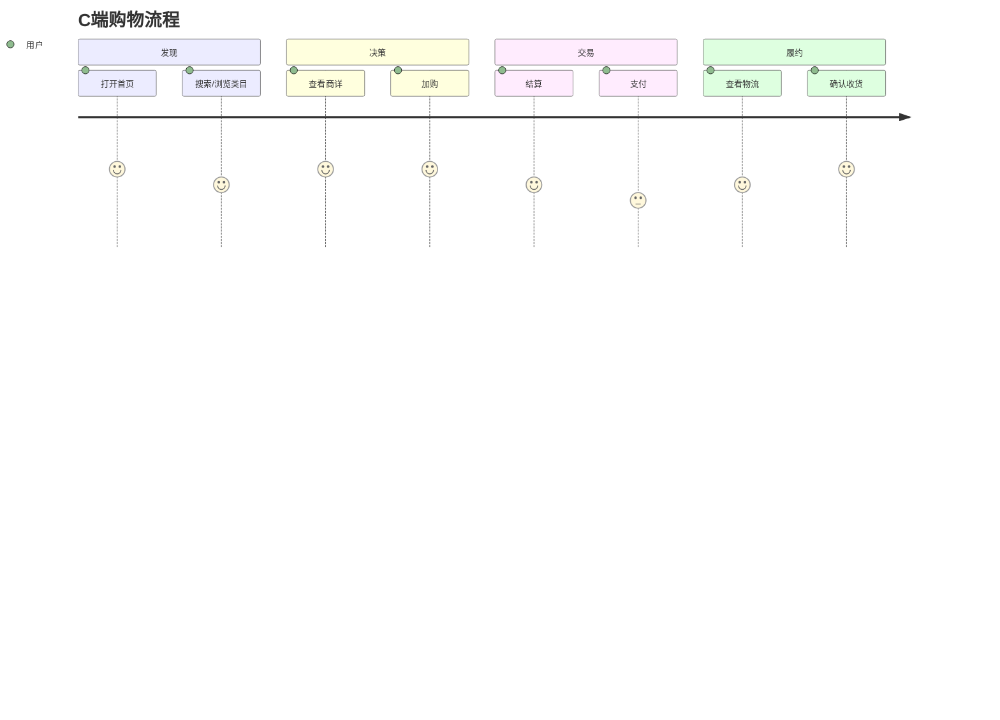

# 用户域调研 — 成员 A

> 完成后合并要点到 `docs/BUSINESS_GLOSSARY.md` 与 `docs/domain/DOMAIN_MODEL.md`

## 1. 调研目标

- 理解 C 端用户从注册到复购的完整旅程
- 明确购物车、地址、会员等核心概念
- 对比京东用户端关键流程

## 2. 调研问题清单

- [ ] 注册登录方式有哪些？本项目简化成什么？
- [ ] 购物车存服务端还是客户端？登录前后如何合并？
- [ ] 收货地址上限、默认地址逻辑？
- [ ] 商品收藏、浏览足迹是否做？优先级？
- [ ] 用户端需要哪些订单状态展示？

## 3. 用户旅程（填写）

## 4. 竞品截图与笔记

<!-- 链接或 docs/research/user/notes.md -->

## 5. 结论与建议

### 5.1 本项目 P0 功能
-

### 5.2 可简化点
-

### 5.3 风险点
-

## 6. 参考资料

- 
- 
